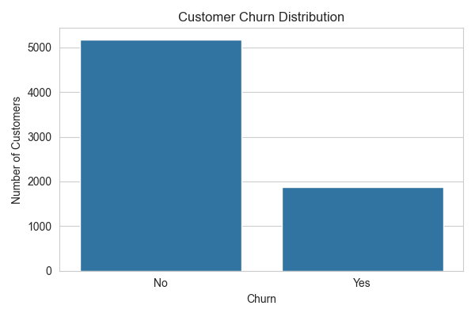
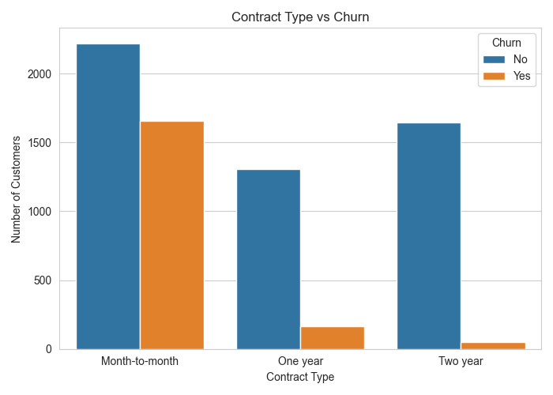
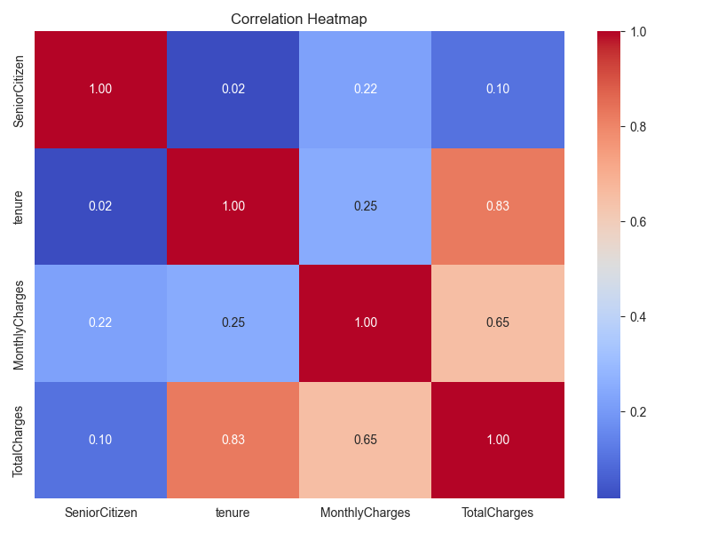
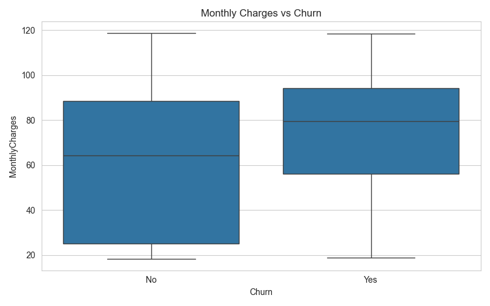
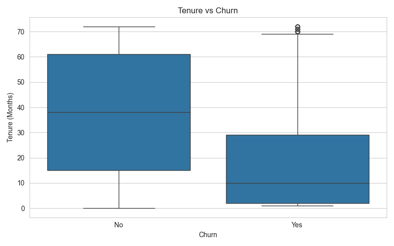

#  Telco Customer Churn Prediction

##  Live Demo

> [Launch the Telco Customer Churn Prediction App](https://telco-customer-churn-odxghtzssr7vln88vckrpz.streamlit.app/)

> Machine Learning project for predicting customer churn using multiple classification models.

## Project Overview

An end-to-end Machine Learning project that predicts customer churn using customer demographic, service, contract, and billing information.

### Key Features

- Data cleaning and preprocessing
- Exploratory Data Analysis (EDA)
- Multiple classification models
- Model evaluation
- Customer churn prediction
- Interactive Streamlit application
- Power BI dashboard
- Saved ML prediction pipeline


##  Project Structure

Telco-Customer-Churn/
├── .streamlit/
├── data/
├── models/
├── reports/
├── src/
├── app.py
├── README.md
├── requirements.txt
└── .gitignore


##  Project Highlights

- Customer churn prediction
- Data cleaning & preprocessing
- Exploratory Data Analysis
- Multiple Machine Learning models
- Model evaluation
- Power BI dashboard
- Interactive Streamlit web application#  Telco Customer Churn Prediction

An end-to-end Machine Learning and Business Intelligence project that analyzes customer churn behavior and predicts whether a telecom customer is likely to churn.

The project combines **Python, Machine Learning, Power BI, and Streamlit** to provide both predictive insights and an interactive business dashboard.

---

##  Power BI Dashboard

An interactive Power BI dashboard was developed to analyze customer churn patterns and identify important business insights.

### Dashboard Preview


The complete Power BI dashboard file is available in the `reports/` folder.

## 📈 Exploratory Data Analysis

The project includes multiple visualizations to explore customer behavior and churn patterns.












##  Project Detail

Customer churn is one of the major challenges faced by telecommunications companies. Losing customers directly affects revenue and increases the cost of acquiring new customers.

This project analyzes telecom customer data to:

- Identify factors associated with customer churn
- Perform data cleaning and exploratory data analysis
- Train machine learning models for churn prediction
- Build a reusable prediction pipeline
- Create an interactive Power BI dashboard
- Develop a Streamlit web application for predictions

The goal is to demonstrate a complete **end-to-end Data Science workflow** from raw data to business insights and deployment.

---

##  Business Problem

Telecom companies need to identify customers who are likely to leave their services.

The objective of this project is to develop a machine learning solution that can:

1. Analyze customer characteristics and service usage.
2. Identify patterns associated with churn.
3. Predict potential customer churn.
4. Present business insights through an interactive dashboard.
5. Provide a simple interface for customer-level predictions.

---

##  Dataset

The project uses a Telco Customer Churn dataset containing customer demographic information, subscribed services, account information, and churn status.

### Major Data Categories

- Customer demographics
- Gender and senior citizen information
- Partner and dependent status
- Tenure
- Phone and internet services
- Contract type
- Payment method
- Monthly charges
- Total charges
- Churn status

### Target Variable

**Churn**

- `Yes` → Customer left the company
- `No` → Customer remained with the company

---

##  Data Preprocessing

The dataset was prepared before machine learning using several preprocessing steps:

- Converted `TotalCharges` into numeric format
- Handled missing values
- Removed unnecessary identifier columns
- Encoded categorical variables
- Separated features and target variable
- Split the dataset into training and testing sets
- Prepared the data for machine learning models

---

##  Exploratory Data Analysis

Exploratory Data Analysis was performed to understand customer behavior and identify relationships between customer characteristics and churn.

The analysis includes:

- Churn distribution
- Customer tenure analysis
- Contract analysis
- Payment method analysis
- Service usage analysis
- Customer demographic analysis
- Numerical feature analysis

Visualizations generated during the analysis are available in:

```text
reports/figures/
